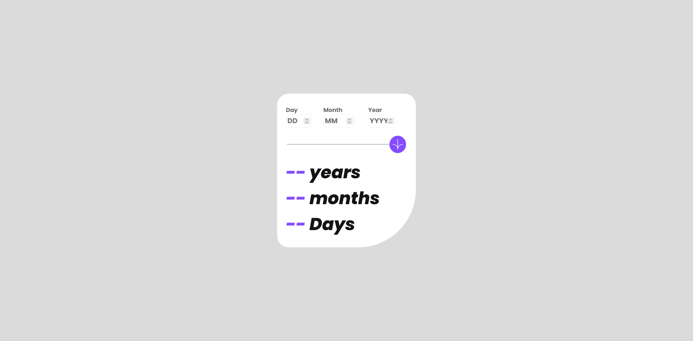
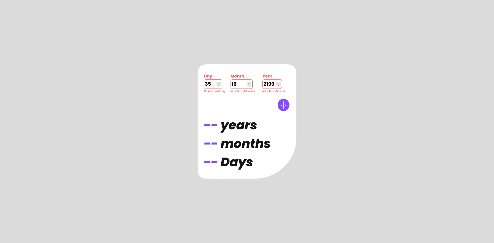
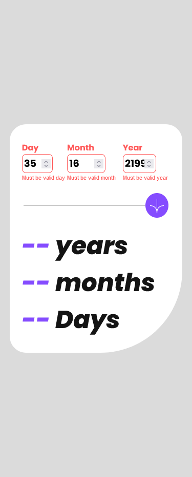
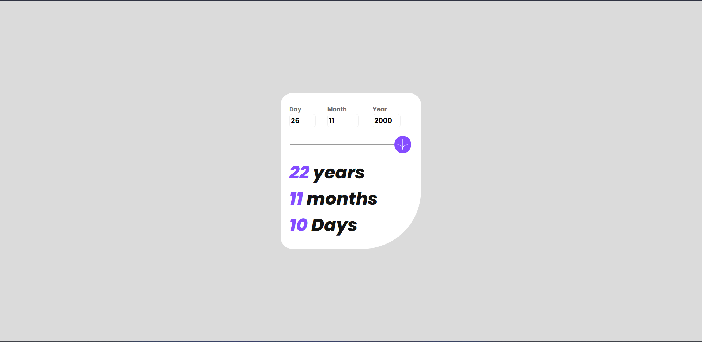

# Frontend Mentor - Age calculator app solution

This is a solution to the [Age calculator app challenge on Frontend Mentor](https://www.frontendmentor.io/challenges/age-calculator-app-dF9DFFpj-Q). 

## Table of contents

- [Overview](#overview)
  - [The challenge](#the-challenge)
  - [Screenshot](#screenshot)
  - [Links](#links)
- [My process](#my-process)
  - [Built with](#built-with)
  - [What I learned](#what-i-learned)
  - [Continued development](#continued-development)
  - [Useful resources](#useful-resources)
- [Author](#author)
- [Acknowledgments](#acknowledgments)
## Overview

### The challenge

Users should be able to:

- View an age in years, months, and days after submitting a valid date through the form
- Receive validation errors if:
  - Any field is empty when the form is submitted
  - The day number is not between 1-31
  - The month number is not between 1-12
  - The year is in the future
  - The date is invalid e.g. 31/04/1991 (there are 30 days in April)
- View the optimal layout for the interface depending on their device's screen size
- See hover and focus states for all interactive elements on the page
- **Bonus**: See the age numbers animate to their final number when the form is submitted

### Screenshot

This is was taken on firefox and as such does not support -webkit- classes due to which the -webkit-inner-spin-button, -webkit-outer-spin-button are not supported by it.

This was taken on a brave browser which does support -webkit- classes and as such no outer/inner-spin-button was seen.

### Links

- Solution URL: [Add solution URL here](https://your-solution-url.com)
- Live Site URL: [Add live site URL here](https://your-live-site-url.com)

## My process

### Built with

- Semantic HTML5 markup
- CSS custom properties
- Flexbox
- CSS Grid

### What I learned

This was my second project on frontend Mentor and I learned more about css grid and flexbox, The trickiest part of the project was animating the numbers for which I had help from a youtube video and found another resource to help in the formula for the age calculator. Got a hands-on of what an HTMLCollection is and how to work with it.

### Continued development

I want to focus more on animating the numbers more smoothly, (maybe adding a fade-in or something of the sort) as that I feel would go with the design a bit more.

### Useful resources

- [Animating Numbers](https://www.youtube.com/watch?v=WfDIU93fN3o) - This helped me to animate the numbers and complete the bonus challenge.
- [Age calculator](https://www.javatpoint.com/calculate-age-using-javascript) - This website helped to make the age calculator more accurate and specific as requried by the challenge.

## Author

- Website - [Add your name here](https://www.your-site.com)
- Frontend Mentor - [@yourusername](https://www.frontendmentor.io/profile/yourusername)
- Twitter - [@yourusername](https://www.twitter.com/yourusername)

**Note: Delete this note and add/remove/edit lines above based on what links you'd like to share.**

## Acknowledgments

This is where you can give a hat tip to anyone who helped you out on this project. Perhaps you worked in a team or got some inspiration from someone else's solution. This is the perfect place to give them some credit.

**Note: Delete this note and edit this section's content as necessary. If you completed this challenge by yourself, feel free to delete this section entirely.**

[def]: ./screenshots/desktop-view.png